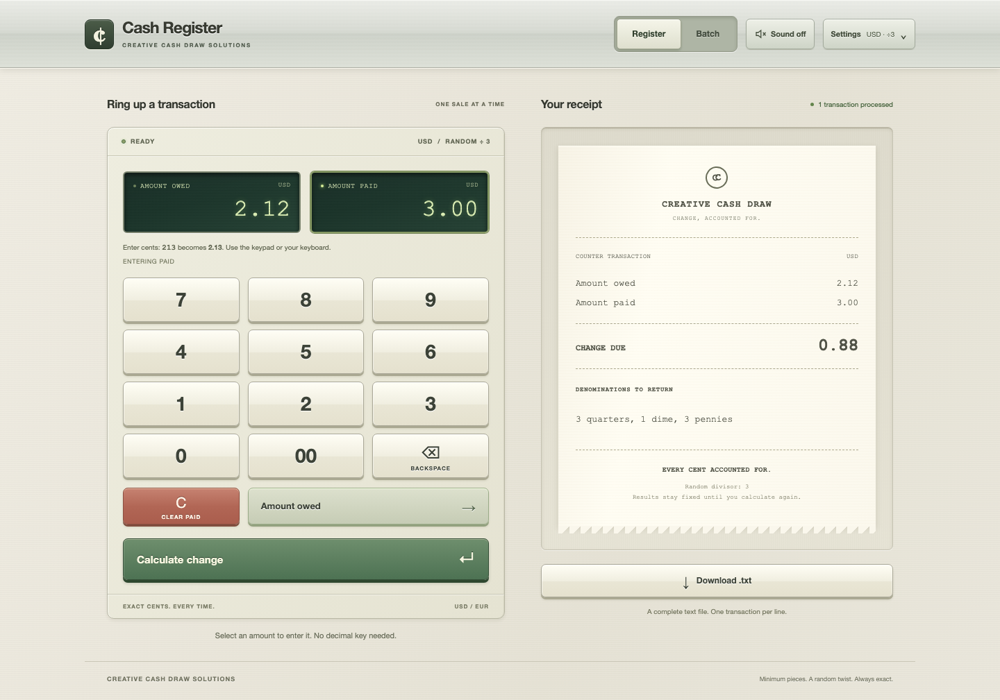
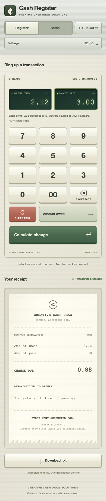

# Cash Register

A TypeScript solution to [TrueFit's exercise](docs/ORIGINAL_BRIEF.md). One calculation
core serves a file-to-file CLI and a React/Node web app. Money uses integer cents.
Normal transactions minimize physical pieces; owed amounts divisible by the
configured divisor receive randomized, exact change.

## Start the web app

Requires Git, Node.js **22.12 or newer**, and npm. No database, API keys or other
services are needed. Clone the submission branch; the upstream exercise's `main`
branch does not contain this implementation.

```sh
git clone --branch assessment/ed-anderson https://github.com/eca20/CashRegister.git
cd CashRegister
npm ci
npm run build
npm run serve
```

**Open [http://127.0.0.1:3000](http://127.0.0.1:3000) in your browser.** The server
serves both the website and its calculation API. Keep that terminal running while
using the app; press **Ctrl+C** to stop it. If you already have the submission
checked out, start at `npm ci` in the project directory.

Try a transaction:

1. In **Register**, enter `212` on the keypad: amount owed becomes **2.12**.
2. Select **Amount paid** and enter `300`: amount paid becomes **3.00**.
3. Choose **Calculate change**. The receipt shows **0.88**:
   **3 quarters, 1 dime, 3 pennies**.
4. For files, switch to **Batch**, choose **Use sample**, then **Calculate change**
   and **Download .txt**. You can also upload `examples/input.txt`.

`npm run serve` starts the browser app. `npm start` runs the separate file CLI
described [below](#run-the-file-cli).

## Screenshots

Actual Chromium captures of the running app using the transaction above. Desktop
uses a 1440 × 1000 viewport; mobile uses a 390 × 844 touch viewport. The mobile
image includes the full scrollable page, with the receipt below the keypad.

### Desktop register



### Mobile register



[Screenshot capture instructions](docs/screenshots/README.md) explain how to
reproduce these images against the real API. Mobile is browser emulation, not a
photograph or a claim of testing on a physical phone.

## Run with Docker

With Docker installed and running, clone the submission branch as above and run
these commands from `CashRegister`. Node.js and npm are not needed on the host.

```sh
docker build -t truefit-cash-register .
docker run --rm --stop-timeout 20 -p 127.0.0.1:3000:3000 truefit-cash-register
```

Open **[http://127.0.0.1:3000](http://127.0.0.1:3000)**. Keep the container running;
Ctrl+C stops it and `--rm` removes it. The image runs as non-root and includes the
compiled server and frontend assets. If host port 3000 is busy, use
`-p 127.0.0.1:3001:3000` instead and open `http://127.0.0.1:3001`.

## Open on a phone

For a phone on the same trusted Wi-Fi as your computer, stop the locally running
Node server and restart it with a network-accessible bind address:

```sh
# macOS / Linux
HOST=0.0.0.0 npm run serve
```

```powershell
# Windows PowerShell
$env:HOST = "0.0.0.0"
npm run serve
```

Find your computer's local IP address in its network settings, then open
`http://<computer-LAN-IP>:3000` on the phone. Allow the Node process through your
computer's firewall if prompted. On a phone, `localhost` points to the phone,
so use the computer's address. For Docker, use `-p 3000:3000` to expose the
container on the computer's network interfaces. The default loopback-only commands
above are for browsing on the same computer.

## Run the file CLI

After `npm ci` and `npm run build` in the project directory:

```sh
npm start -- examples/input.txt change.txt
```

Open the generated `change.txt` in a text editor (or use `cat change.txt` in a
macOS/Linux terminal, `Get-Content change.txt` in PowerShell).
The first two lines are `3 quarters,1 dime,3 pennies` and `3 pennies`.
The third varies and sums to 167 cents; `167 pennies` is one valid result.

```sh
npm start -- examples/input.txt euro-change.txt --currency EUR --divisor 5
npm start -- --help
```

Output files must not already exist. Errors identify the offending line and return
a nonzero exit code. The original input and previous outputs cannot be overwritten.

## Using the register

The page is the register: ivory raised
keys, recessed green displays, brushed-metal controls and a paper receipt, built
with CSS and ordinary HTML. It adapts from a two-column desktop workspace to a
single column on mobile.

- **Register** starts with both amounts at zero and owed selected. Click either
  display or the owed/paid key to select it. Digits enter cents: `213` becomes
  `2.13`. `00`, Backspace and Clear edit the selected amount. With a display
  focused, keyboard digits work the same way; Delete/Escape clear it. Select-all
  replaces the amount. Enter advances from owed to paid, then calculates.
- Paste digits as cents, or paste a decimal amount such as `2.13`. Pasting replaces
  the selected amount. Invalid or oversized entries show an error and preserve
  the previously accepted amount; they are never silently clamped.
- **Batch** keeps the editor, upload and sample workflow. Large batches preview
  the first 100 rows; downloads retain every row in the original output format.
- **Settings** expands to currency and random divisor. Its summary shows the
  active values. Inputs persist between modes, but editing inputs, changing
  modes or changing settings clears previous results. Recalculating can change
  random denominations.
- **Sound** is off on each page load. Opt in for quiet key clicks and a brief
  chime; audio failure does not affect calculations. Reduced-motion preferences
  disable key movement and receipt animation.

## Frontend development

After the initial install and build, use two terminals in the project directory:

```sh
# Terminal 1: calculation API and built website
npm run serve
```

```sh
# Terminal 2: frontend with live updates
npm run dev
```

Open the **Local URL printed by Vite**, normally `http://localhost:5173`.
Vite proxies `/api` to the server on port 3000. Frontend edits appear in the Vite
page; the website on port 3000 uses built assets. After backend changes, stop the
API server, rerun `npm run build`, and restart `npm run serve`.

## Startup help

| Symptom                                                   | What to do                                                                                                                                                                                                           |
| --------------------------------------------------------- | -------------------------------------------------------------------------------------------------------------------------------------------------------------------------------------------------------------------- |
| `npm start` prints CLI usage instead of opening a website | Use `npm run serve`, then open the browser URL yourself.                                                                                                                                                             |
| Missing `dist/src/serve.js` or frontend build             | Run `npm ci` and `npm run build` before `npm run serve`.                                                                                                                                                             |
| `EADDRINUSE` / port 3000 already in use                   | Stop the other server, or use `PORT=3001 npm run serve` on macOS/Linux; in PowerShell set `$env:PORT = "3001"` before running `npm run serve`. Open port 3001 instead. The Vite development proxy expects port 3000. |
| Browser cannot connect                                    | Keep the server terminal running and check its startup output. For a phone, follow the network instructions above.                                                                                                   |
| Website returns 404 but the API works                     | Remove a previously set `SERVE_WEB=false` or set it to `true`, then restart the server.                                                                                                                              |
| Editing `.env` has no effect                              | This app does not automatically load `.env`; supply settings through your shell or container. See [.env.example](.env.example).                                                                                      |
| CLI reports that output already exists                    | Choose a new output filename. The CLI intentionally protects existing files.                                                                                                                                         |

## Verify

```sh
npm run check
npx playwright install chromium
npm run test:e2e
```

`check` runs formatting, strict type checks, production build, core/CLI/HTTP/service
tests, and transcript-sanitizer tests. Browser tests cover desktop/mobile viewports. `npm run test:coverage`
reports coverage. [Verification results](docs/VERIFICATION.md) map tests to requirements.

## Contract and assumptions

- Input: UTF-8, optional BOM, one `owed,paid` row per line, LF/CRLF, optional final
  newline. No header, quoting, currency symbols or decimal commas.
- Amounts: nonnegative, up to `10000000.00`, zero to two decimal places. Surrounding
  whitespace and leading zeros are accepted; excess precision is rejected rather
  than rounded. Both currencies use two decimal places.
- Random trigger: **owed cents modulo divisor equals zero**. The brief's 3.33/5.00
  example selects random because 333 is divisible by 3, though change is 167 cents.
  Divisor defaults to 3 and must be a positive safe integer. Zero owed also matches.
- No change: `No change due`. Underpayment or an invalid/blank data row fails the
  whole batch. An empty file produces an empty file. A final newline is a delimiter,
  not an extra row.
- Output: one line per transaction, descending denominations, explicit plurals,
  no spaces after commas, final LF for nonempty output. Complete batch validation
  precedes output file creation.
- Limits: 1 MiB input; 2 MiB HTTP body. CLI exit codes: 0 success, 1 processing/I/O
  failure, 2 invalid arguments.
- Tables describe stocked till denominations with unlimited counts. USD: $100,
  $50, $20, $10, $5, $1 and 25/10/5/1-cent pieces. EUR: €200, €100, €50, €20, €10,
  €5 and €2/€1/50/20/10/5/2/1-cent pieces.
- Greedy minimum is supported for these fixed tables. Arbitrary denomination
  systems, limited inventory, cash rounding and exchange conversion are outside
  the contract. EUR support does not imply French-language input/output.
- Random counts are drawn per denomination; pennies settle the remainder. This
  is **not uniform sampling of all combinations**. Repeated results, including the
  minimum-change result, are allowed.

## Design

The core is in `src/money.ts`, `currency.ts`, `change.ts` and `register.ts`.
CLI and HTTP use the same `processFile`; React does not calculate change.
See [architecture](docs/ARCHITECTURE.md) for extension examples and tradeoffs.

## Service integration scaffold

The app can run as one service in a larger system. `SERVE_WEB=false npm run serve`
exposes the calculation API and health endpoints without serving the frontend.
The default service remains stateless and makes no external calls.

An injectable async application service separates HTTP from the pure calculator.
Future database adapters implement `CalculationRepository`; future API clients
plug into application services at the same boundary. Request IDs, cancellation,
validated configuration, readiness and shutdown/cleanup hooks are in place.
The file CLI remains independent of service integrations.

See the [integration guide](docs/SERVICE_INTEGRATION.md),
[OpenAPI contract](docs/openapi.json), and [environment example](.env.example).
The guide documents persistence failure semantics and the decisions needed when
real integrations are added. No database, remote client or retry policy is installed.

## AI use and submission

Codex (GPT-6 Astra) generated implementation, tests and initial documentation. Ed
supplied the brief and role context, approved the approach, and directed the
skeuomorphic revision: the page itself functions as the register. Human design
feedback and pending code review are recorded separately.

| Requested item             | Artifact                                                                             |
| -------------------------- | ------------------------------------------------------------------------------------ |
| Full raw prompt transcript | [Full redacted transcript](docs/ai/TRANSCRIPT.md); exact original retained privately |
| Decision log               | [Decisions and attribution](docs/DECISIONS.md)                                       |
| Verification               | [Test evidence](docs/VERIFICATION.md)                                                |
| Tools/task mapping         | [Tools](docs/TOOLS.md)                                                               |
| Self-critique              | [Ed's self-critique](docs/SELF_CRITIQUE.md)                                          |

[References](docs/REFERENCES.md) disclose prior-PR influence. The original brief is
preserved unchanged. [Handoff](docs/HANDOFF.md) records submission and review guidance.
