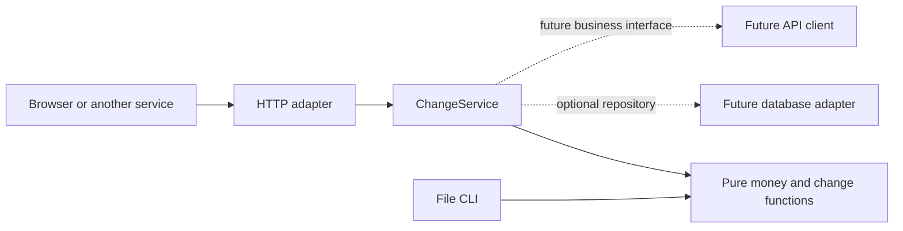

# Running as one service in a larger system

The application can run as a standalone HTTP calculation service. Its default
deployment is stateless and makes no outbound API calls. Database persistence and
remote integrations are extension points, not implemented integrations.



## Boundaries that are in place

| File                                | Responsibility                                                                                                               |
| ----------------------------------- | ---------------------------------------------------------------------------------------------------------------------------- |
| `src/application/change-service.ts` | Async application contract, core invocation, optional repository interface, immutable calculation records and typed failures |
| `src/server.ts`                     | HTTP validation, size limits, status mapping, request ID, cancellation/deadline, optional static assets and health routes    |
| `src/serve.ts`                      | Composition root: build configured dependencies, start the process and handle signals                                        |
| `src/runtime.ts`                    | Injectable service, readiness hook, request draining and adapter cleanup with a shutdown deadline                            |
| `src/config.ts`                     | Validated environment configuration                                                                                          |
| `src/adapters/`                     | Documented home for future database drivers and outbound API clients                                                         |
| `docs/openapi.json`                 | Machine-readable HTTP contract for callers                                                                                   |

No dependency injection framework, ORM, API-client package, broker or deployment
platform is required. The CLI still calls the pure core directly and does not
accidentally gain persistence or network side effects.

## Run without the frontend

```sh
npm run build
SERVE_WEB=false PORT=3000 npm run serve
```

Or use the existing container:

```sh
docker build -t truefit-cash-register .
docker run --rm --read-only --stop-timeout 20 \
  -e SERVE_WEB=false -p 127.0.0.1:3000:3000 truefit-cash-register
```

Headless mode returns 404 for UI/static paths. The calculation and health endpoints
work without web assets. The shipped image still includes those assets so the same
image can serve the local demo; a smaller API-only image could omit them later.

```sh
curl -H 'Content-Type: application/json' -H 'X-Request-ID: checkout-123' \
  -d '{"input":"2.12,3.00","currency":"USD","divisor":3}' \
  http://127.0.0.1:3000/api/change
```

The existing `{ "output": "..." }` response and `{ "error": "..." }` failure shape
remain unchanged. A supplied `X-Request-ID` is preserved if it contains 1–128 ASCII
letters, digits, dots, underscores or hyphens; otherwise a UUID is generated. The
response always includes this header. It is correlation metadata, not an identity,
authorization credential, transaction identifier or idempotency key.

| Setting               | Default                                  | Meaning                                                                  |
| --------------------- | ---------------------------------------- | ------------------------------------------------------------------------ |
| `HOST`                | `127.0.0.1` locally; `0.0.0.0` in Docker | Listen interface                                                         |
| `PORT`                | `3000`                                   | Integer 1–65535                                                          |
| `SERVE_WEB`           | `true`                                   | `false` exposes API/health only                                          |
| `REQUEST_TIMEOUT_MS`  | `10000`                                  | HTTP receive timeout and separate calculation deadline; integer 1–120000 |
| `SHUTDOWN_TIMEOUT_MS` | `15000`                                  | Overall drain/cleanup deadline; integer 1–120000                         |

`.env.example` documents these settings. Supply them through the shell/container;
there is no implicit `.env` loader. Database URLs, API credentials and adapter
configuration should be added and validated only when those integrations exist.

## Adding persistence later

Implement `CalculationRepository.save(record, context)` using the chosen database,
then compose it with the existing application service. For example, this helper
accepts an already-constructed adapter; it does not implement a database:

```ts
import { createChangeService } from "./application/change-service.js";
import type { CalculationRepository } from "./application/change-service.js";
import { createServiceRuntime } from "./runtime.js";
import { readConfig } from "./config.js";

function composeWithRepository(
  repository: CalculationRepository,
  closeRepository: () => Promise<void>,
) {
  return createServiceRuntime(readConfig(), {
    service: createChangeService({ repository }),
    dispose: closeRepository,
  });
}
```

The service passes a frozen record containing the exact submitted input, normalized
currency/divisor, output, request ID and calculation timestamp. It saves only after
the complete batch calculates successfully, and waits for the save before returning
success. With a repository enabled, save failure returns 503; it never silently
continues as though data were durable. Without one, nothing is stored.

The repository must define atomic write behavior and storage identity. A timeout
or disconnect can happen after a database committed, so cancellation is not a
rollback guarantee. No persistence retry or exactly-once behavior is provided.
Because random change can differ across requests, a durable checkout workflow
needs an explicit idempotency contract that stores and returns the accepted result.

## Adding outbound APIs later

Add a client in `src/adapters/` with an application-facing interface that describes
the actual business operation. Inject it into an application implementation or
wrapper of `ChangeService`, then inject that service into the runtime. The HTTP
handler and frontend continue using the same calculation contract.

Use the supplied abort signal and propagate the correlation ID. Translate remote
failures at the adapter boundary; validate remote responses before trusting them.
The current 503 mapping covers expected dependency failures, while unexpected
exceptions return a generic 500. The handler returns 504 when its calculation
deadline expires, including when a future asynchronous adapter ignores its signal.
This bounds the HTTP wait, not the adapter's underlying work. Synchronous CPU work
still blocks the event loop and cannot be preempted by a timer.

Choose retry, authentication, timeouts and failure policy for the specific remote
operation. Do not automatically retry side effects. If a future flow must persist
a result and publish it to another service, decide on consistency/outbox behavior
then; the scaffold does not imply an atomic database-plus-HTTP transaction.

## Lifecycle and health

- `GET /health/live`: 200 while the process can respond.
- `GET /health/ready`: 200 while accepting calculations, 503 when draining or when
  an injected `isReady` hook reports false. Defaults do not probe any database or
  remote service. Adapters can supply cached health when implemented.
- SIGINT/SIGTERM stops accepting connections, allows active requests to finish,
  then calls injected adapter cleanup once. The overall shutdown deadline forces
  remaining connections closed; the entry point exits nonzero on shutdown failure.
- Keep an orchestrator's termination grace period longer than the configured
  shutdown deadline. The Docker health check uses readiness and the configured port.

This is a scaffold for service composition, not a claim of production deployment
readiness. Actual system integration must supply its authentication/authorization,
secret management, telemetry, traffic controls and durable transaction semantics.
Those choices belong to the surrounding system and concrete integrations.
